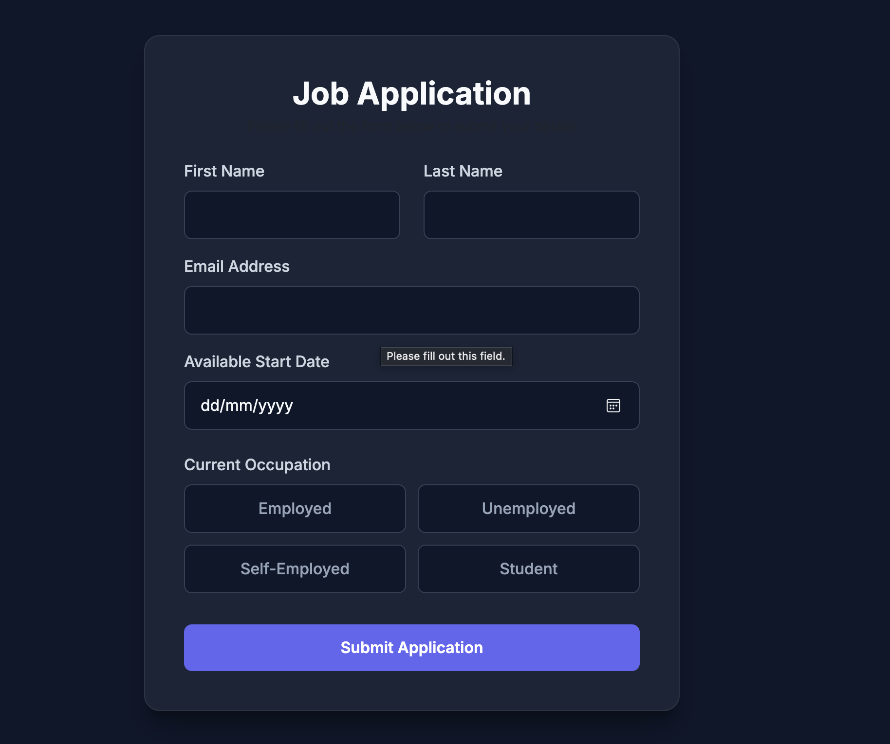
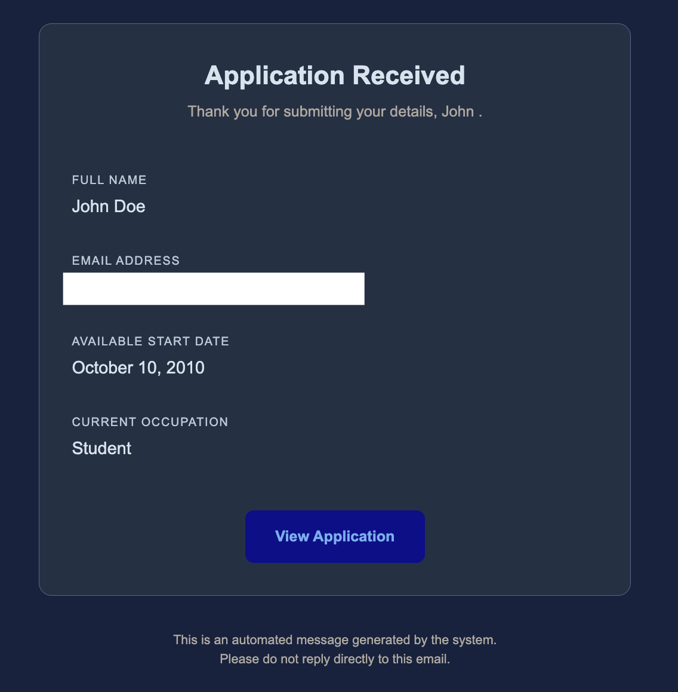

  <h1>📝 Job Application Form (Flask)</h1>

  

    A modern <strong>web application</strong> for collecting and managing job applications. 
    Built with <strong>Flask</strong> and <strong>SQLAlchemy</strong> — full backend validation, automated email notifications, and a polished dark UI.
  

  

    
    
    
    
  

 

---

## 📸 Screenshots

  
    
  
  &nbsp;&nbsp;

 

---

## ✨ Features

* **📋 Full Form Submission:** Collects essential candidate data (name, email, available date, occupation) through a clean, intuitive interface.
* **✉️ Automated Email Confirmation:** Automatically dispatches a styled confirmation email to the candidate using `Flask-Mail` and custom HTML templates.
* **✅ Robust Validation:** Secure backend validation via `Flask-WTF` and `WTForms` (email address verification, string length checks, required fields).
* **🎨 Dark UI & Glassmorphism:** A premium, eye-catching visual interface featuring a glassmorphism-inspired dark theme, custom CSS, and smooth Bootstrap 5 components.
* **🗄️ Integrated Database:** Persists all submissions using `SQLAlchemy` (pre-configured with SQLite, easily scalable to PostgreSQL).
* **🔒 Env-Based Security:** Protects secret keys and email credentials by loading them strictly from a `.env` file — never hardcoded.

---

## 🧠 Under the Hood

### Architecture
The application strictly follows the **Application Factory** pattern and utilizes **Blueprints** to keep the codebase modular, clean, and scalable:

    app/
    ├── __init__.py    # App factory and extension initialization
    ├── routes.py      # Core routing and business logic
    ├── models.py      # SQLAlchemy database models
    └── forms.py       # WTForms validation classes

### Email Handling
The notification system employs an elegant HTML container template for modern email clients, while providing a plain-text fallback for maximum compatibility:

    message = Message(
        subject="New Form Submission Confirmation",
        recipients=[form.email.data],
        body=text_body,
        html=html_body,
    )
    mail.send(message)

### Data Validation
Every submission routes through the `validate_on_submit()` method. The app guarantees that no invalid records hit the database. Any invalid field automatically triggers a flash message alert on the frontend to guide the user.

---

## 📁 Project Structure

    Flask-Form/
    ├── app/
    │   ├── __init__.py         # Application instance creation
    │   ├── config.py           # Environment variables configuration
    │   ├── extensions.py       # SQLAlchemy and Flask-Mail setup
    │   ├── forms.py            # JobApplicationForm definition
    │   ├── models.py           # FormSubmission table schema
    │   └── routes.py           # Main routing for form handling
    ├── static/
    │   └── css/
    │       └── style.css       # Custom Dark UI styles, grid layout, hover effects
    ├── templates/
    │   ├── email_confirmation.html # Responsive email template
    │   └── index.html          # Form frontend interface
    ├── .env                    # Local credentials (not committed)
    ├── .gitignore              # Ignored files (including .env and sqlite DBs)
    ├── requirements.txt        # Python dependencies
    └── run.py                  # Application entry point

---

## 🗄️ Environment Setup

To run the project and enable email dispatching, create a `.env` file in the root directory (next to `run.py`) and populate it with your credentials:

    SECRET_KEY=your_secure_development_key_here
    SQLALCHEMY_DATABASE_URI=sqlite:///data.db
    EMAIL=your_email_address@gmail.com
    PASSWORD=your_app_password_or_email_password

*Note: The SQLite database will be automatically generated and configured upon the first run.*

---

## 🚀 Getting Started

1. **Clone the repository (via HTTPS):**
    git clone https://github.com/AndrewTechTips/Flask-Form.git
    cd Flask-Form

2. **Create a virtual environment and install dependencies:**
    python3 -m venv venv
    source venv/bin/activate
    pip install -r requirements.txt

3. **Configure the environment variables** *(see section above)*

4. **Run the application:**
    python run.py

5. **Access the project:** Open your browser and navigate to `http://127.0.0.1:5000` (or the port specified in your console).

---

## 📬 Contact

* **LinkedIn:** [Andrei Condrea](https://www.linkedin.com/in/andrei-condrea-b32148346)
* **Email:** condrea.andrey777@gmail.com

  <i>"A modern, scalable solution for processing job applications." 🚀</i>

